# COPPA

#### Feature:
* Captain register
* Capture caught fish photo
* Fill information and diary about trip and caught fish
* Sync data to server after finish trip in background

## Try me
[Google Play Store](https://play.google.com/store/apps/details?id=com.blogspot.tndev1403.Coppa)

## Screenshots
### 1. Permission request in first time

	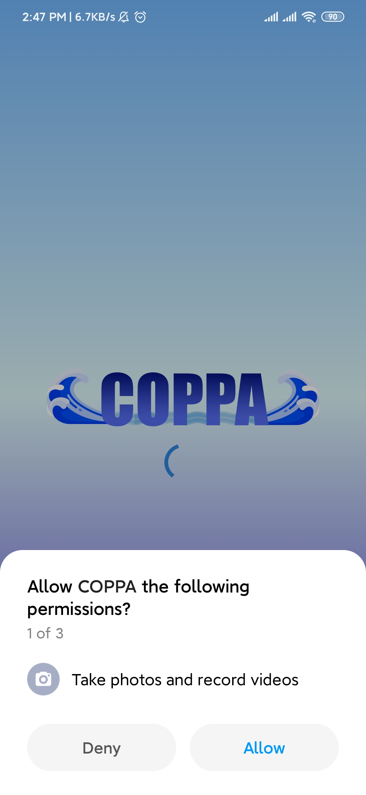

### 2. Initialize fish and its category in first time

	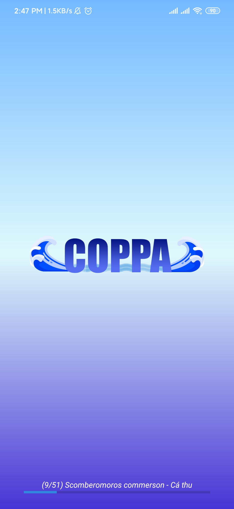

### 3. Request information of captain

	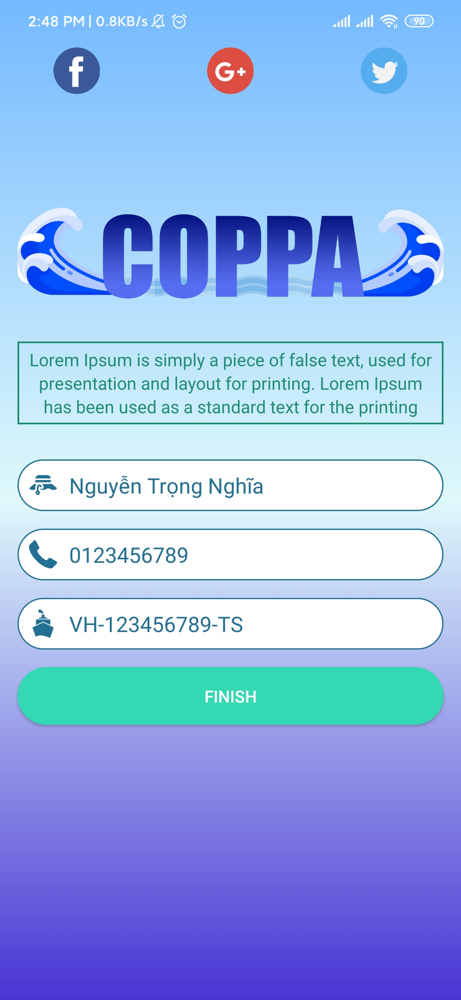

### 4. Wait confirm from captain

	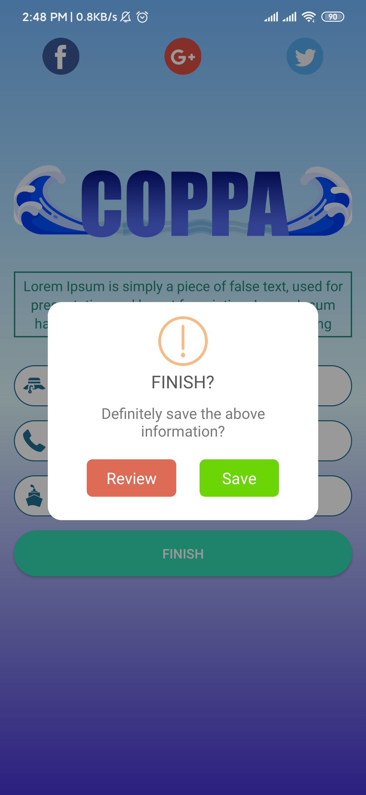

### 5. Home screen in first time (Only show create new trip button)

	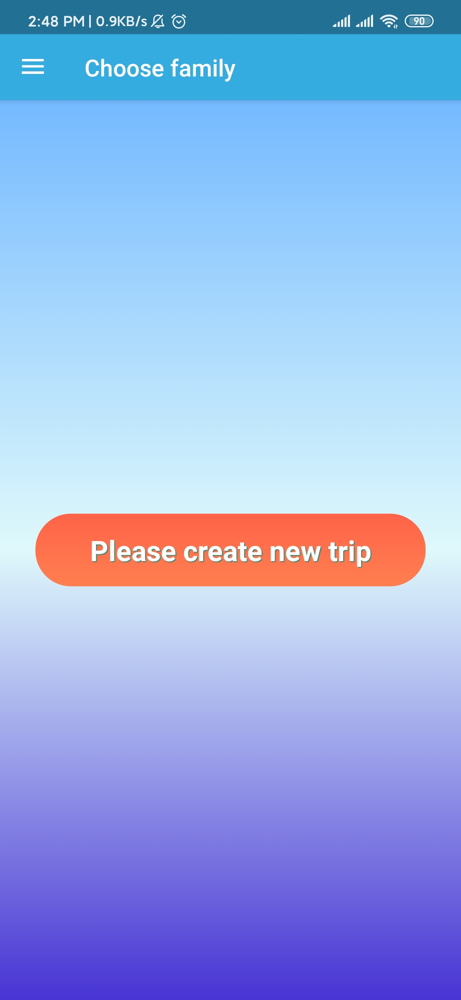

### 6. Wait confirm from captain

	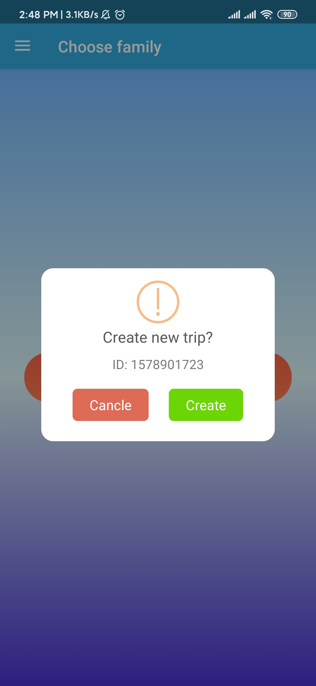

### 7. Create trip success

	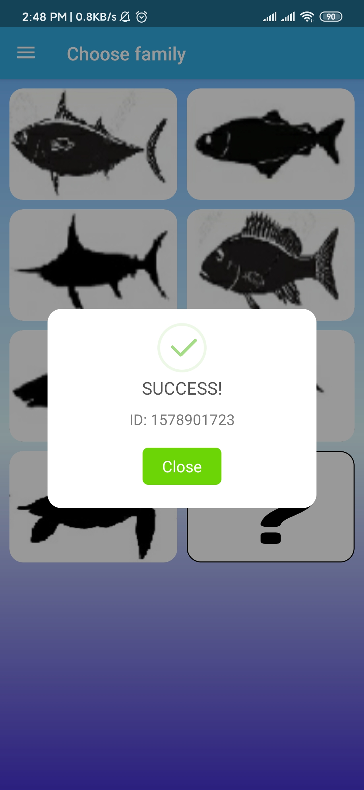

### 8. Show on fish category in system

	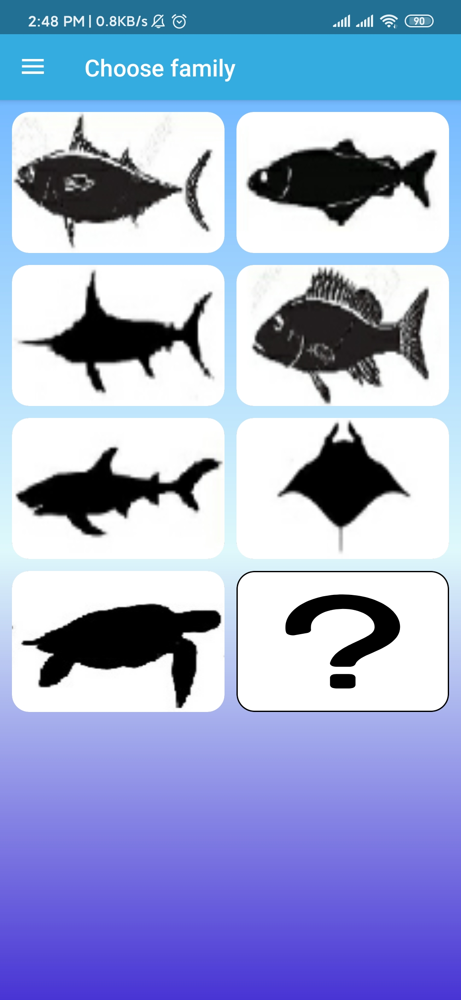

### 9. Default navigation drawer

	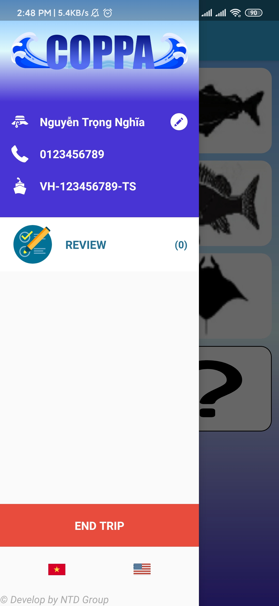

### 10. Select kind of fish in a category

	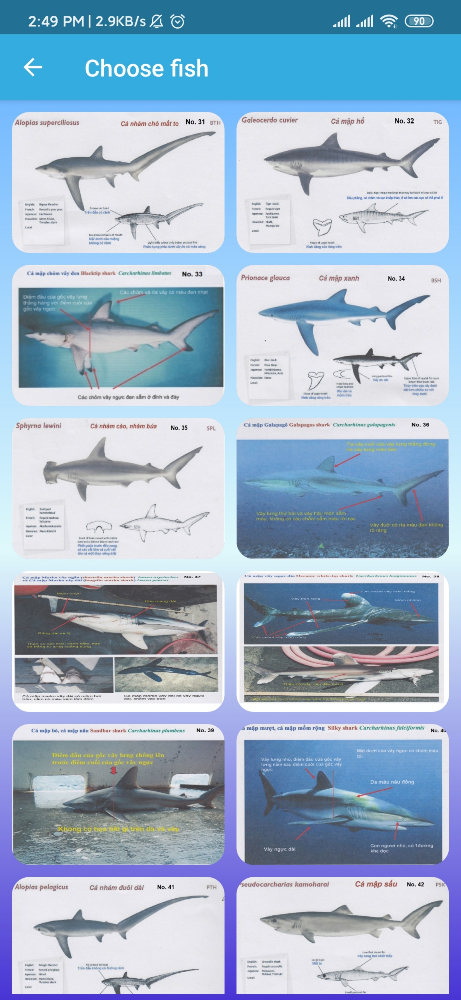

### 11. Default input info of fish activity

	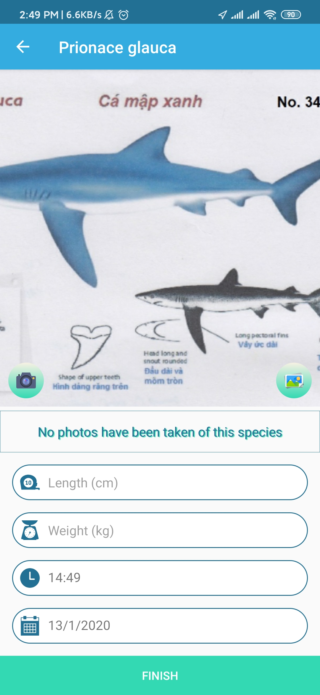

### 12. Kind of fish photo selection

	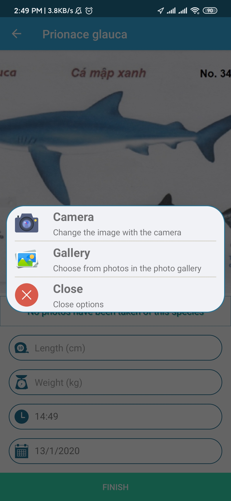

### 13. After select photo and input some information

	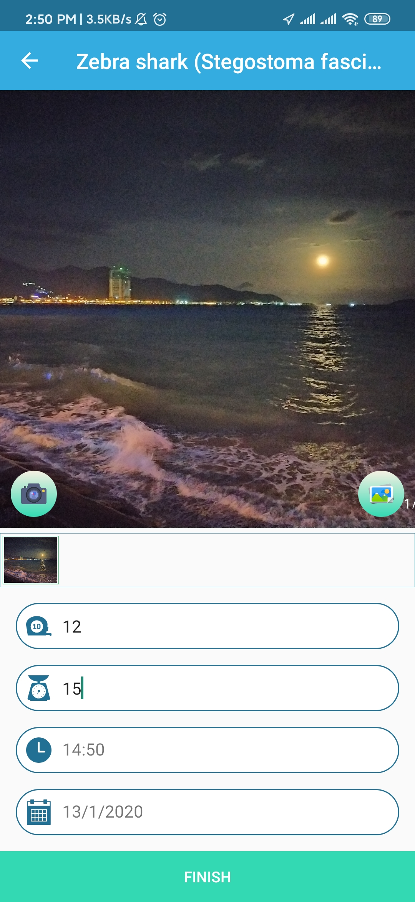

### 14. Select time when you caught fish

	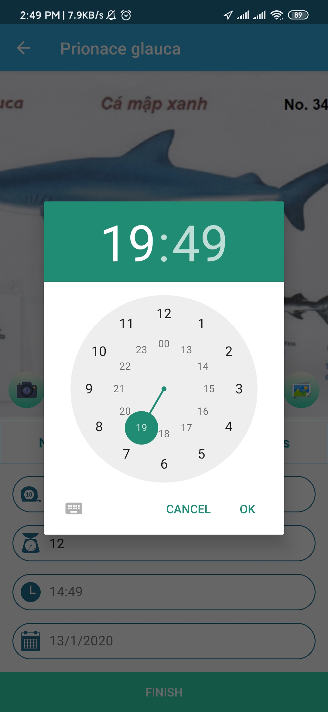

### 15. Select date when you caught fish

	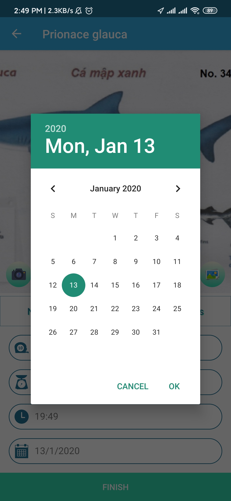

### 16. Review inserted caught fish info

	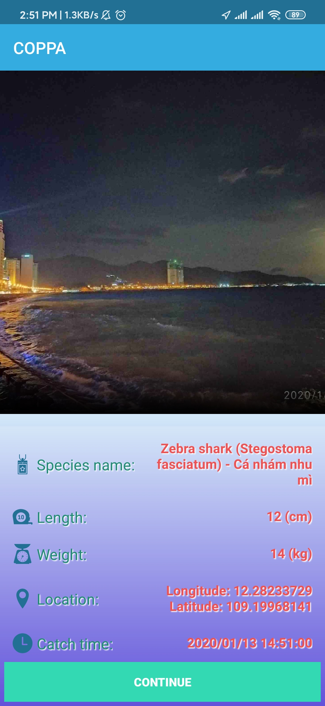

### 17. Review all insert history record

	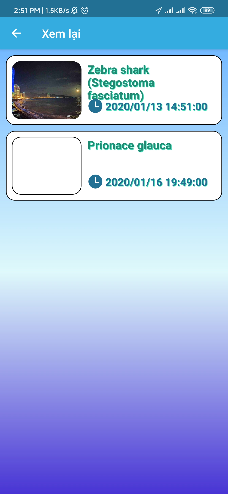

### 18. Review a inserted record

	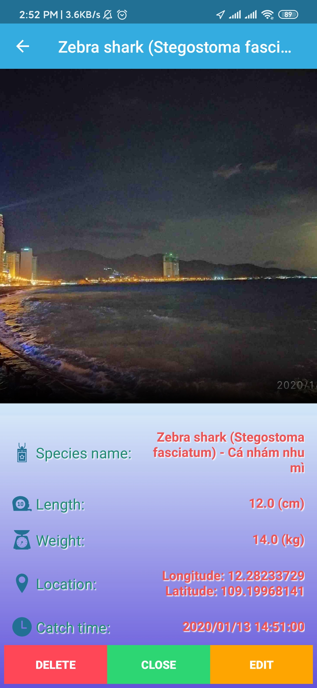

### 19. Wait confirm if you want to delete

	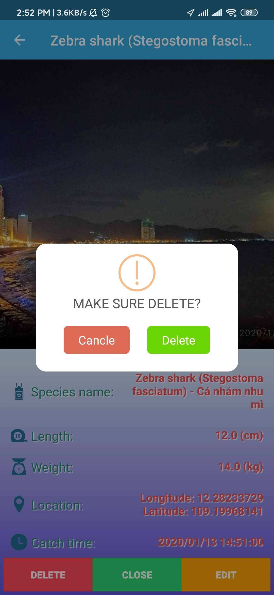

### 20. Edit dialog

	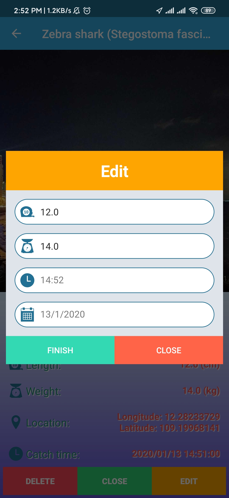

### 21. Sync success after press end trip button

	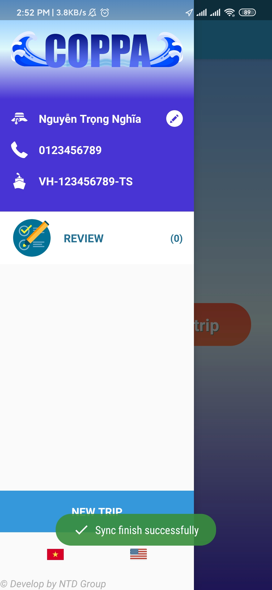

## Designer
#### Name: [Nguyen Trong Nghia](https://www.facebook.com/tx.trongnghia98)
#### Email: projects.futuresky@gmail.com
#### Phone: +84 886 48 3147
#### Blogger: [TNdev1403](https://tndev1403.blogspot.com)
